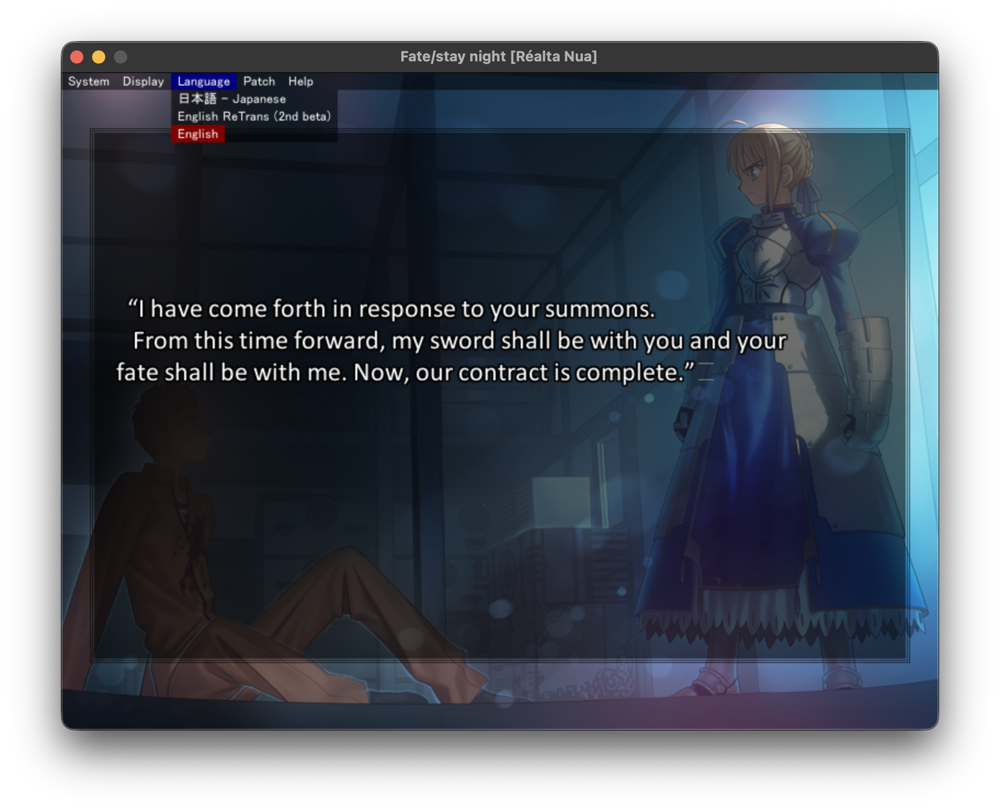

# Fate/stay night Realta Nua Ultimate Edition SDL2 for Linux and macOS

This project runs Fate/stay night **Realta Nua Ultimate Edition** (NOT the Steam Remaster) with the
[Kirikiri SDL2](https://github.com/krkrsdl2/krkrsdl2) runtime on Linux or macOS.

You must provide an existing Ultimate Edition installation. No Ultimate Edition game files are redistributed by this repository.
The platform installer adds a native runtime beside the existing Windows runtime;
it does not copy, modify, or delete the game's XP3 archives, executables,
configuration, or save data.

The game should work identical to the Windows binary, however videos are currently broken on both Linux and macOS.

This project does not mess with existing game files at all, though it is good practice to back up your saves just in case.

**This project is in its infancy**, and there will be some issues. Please contribute by opening an issue or PR!

**This project was built with Ultimate Edition `v1.1.4`. It seems `v1.1.5` is the latest version, but is harder to find on the internet.**

## Native window and menu

The game runs in a native resizable window with the
platform title bar and window controls. Because Kirikiri SDL2 does not provide
the Windows system-menu API used by Ultimate Edition, the compatibility overlay
enables the game's in-window menu instead. The **System**, **Display**,
**Language**, **Patch**, and **Help** menus remain available at the top of the
game window, with sizing adjusted for the current window scale.



## Requirements

- An existing Ultimate Edition installation containing `patch.xp3`, `data.xp3`, `etc.xp3`, `rule.xp3`, `Fate.exe` or `Fate64.exe`, and the three `icon_*.ico` files.
- Any modern version of Linux and macOS
- **Note: Intel Mac is currently untested but should work. Please open an issue if you are experiencing problems.**

## Install using Ultimate Edition as the base

```sh
git clone https://github.com/jtyuill/fsnrnue-sdl2.git
cd fsnrnue-sdl2
```

### Linux

```sh
./install-linux.sh "/path/to/Fate stay night Realta Nua Ultimate Edition"
```

The Linux installer:

1. validates that the target looks like an Ultimate Edition installation;
2. copies only this repository's native runtime, plugins, launcher, and
   compatibility overlay into `linux/` under the game directory;
3. leaves every game archive and the existing save directory untouched.

Play from any working directory:

```sh
"/path/to/Fate stay night Realta Nua Ultimate Edition/FateLinux.sh"
```

Extra Kirikiri arguments are forwarded, for example:

```sh
./FateLinux.sh -forcelog
./FateLinux.sh -window
```

Re-run `install-linux.sh` after pulling a newer version of this repository. Keep a
backup of your game directory as normal, although the installer only overwrites
its own `FateLinux.sh` and `linux/` runtime files.

### macOS

Install into the standard Ultimate Edition location:

```sh
./install-mac.sh "$HOME/FSNRNUE114"
```

The macOS installer validates the same Ultimate Edition files, installs the
universal runtime under `macos/`, and creates two launch paths:

```sh
"$HOME/FSNRNUE114/FateMac.sh"
open "$HOME/FSNRNUE114/FateMac.app"
```

`FateMac.app` can also be opened directly in Finder. It is a small wrapper
around `FateMac.sh`; it contains no second runtime and no game data. Its
`FateMac.icns` is generated only from your 64×64 `icon_FATE.ico` frame during
installation. Extra Kirikiri arguments are forwarded by both launch formats:

```sh
"$HOME/FSNRNUE114/FateMac.sh" -forcelog -window
open "$HOME/FSNRNUE114/FateMac.app" --args -forcelog -window
```

Re-run `install-mac.sh` after updating the checkout. It idempotently replaces
only its own launcher, `macos/` runtime files, and `FateMac.app`.

On first launch, Ultimate Edition prompts for the save location. Canceling that
prompt keeps `faterealtanua_savedata/` beside the game archives. The resulting
per-install `config.ksc` is not part of a fresh Ultimate Edition installation
and is not required by either platform installer.


## Legal

- No game files of any kind are distributed by this repository.
- This is an unofficial project not endorsed by TYPE-MOON or Beast's Lair. 
- Scripts, documentation, and the compatibility overlay authored for this
  repository are MIT-licensed; see `LICENSE`.
- The native runtime and plugins are third-party components with their own
  terms and provenance; see `Port/THIRD-PARTY-NOTICES.md`.

